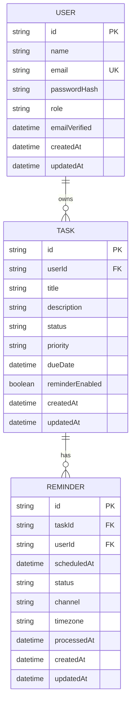

```mermaid
erDiagram
    USER ||--o{ TASK : owns
    TASK ||--o{ REMINDER : has

    USER {
        string id PK
        string name
        string email UK
        string passwordHash
        string role
        datetime emailVerified
        datetime createdAt
        datetime updatedAt
    }

    TASK {
        string id PK
        string userId FK
        string title
        string description
        string status
        string priority
        datetime dueDate
        boolean reminderEnabled
        datetime createdAt
        datetime updatedAt
    }

    REMINDER {
        string id PK
        string taskId FK
        string userId FK
        datetime scheduledAt
        string status
        string channel
        string timezone
        datetime processedAt
        datetime createdAt
        datetime updatedAt
    }
```
